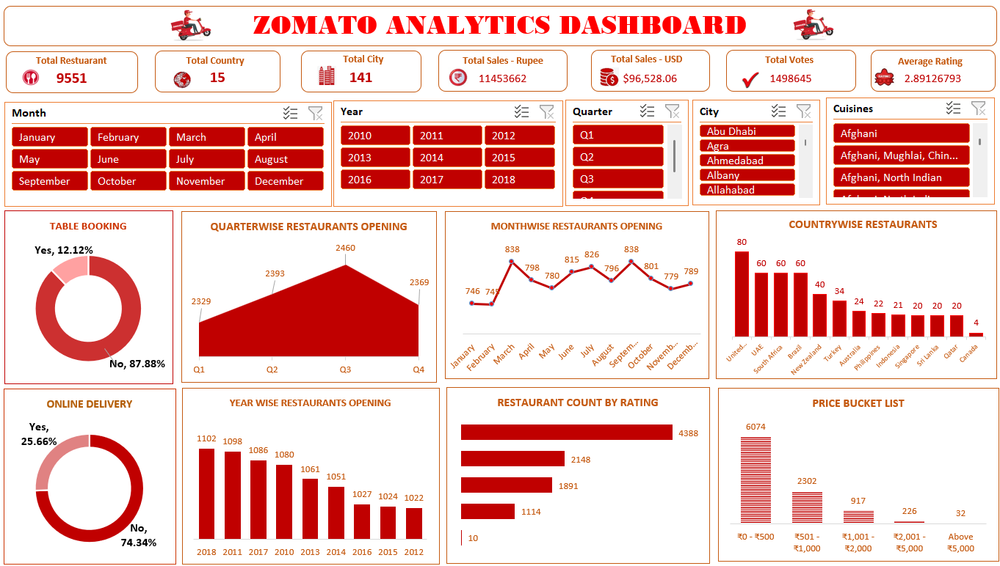

# Zomato Analytics

## Project Overview

Zomato Analytics is a restaurant data analysis project developed as part of the Exceler Data Analyst Project.

The project uses Microsoft Excel to analyze restaurant data and create a dashboard covering restaurant distribution, restaurant openings, ratings, pricing, cuisines, and restaurant services.

## Week 1 — Excel Dashboard

The first phase of the project focuses on analyzing the Zomato restaurant dataset using Microsoft Excel and developing the Zomato Analytics Dashboard.

### Analysis Performed

- Country and city-wise restaurant analysis
- Restaurant openings by year, quarter and month
- Restaurant distribution based on average ratings
- Restaurant distribution based on average price
- Percentage of restaurants with table booking
- Percentage of restaurants with online delivery
- Analysis based on cuisines, city and ratings

### Tools & Techniques

- Microsoft Excel
- Excel Formulas
- PivotTables
- PivotCharts
- Data Analysis
- Dashboard Design

## Dashboard

The Excel dashboard summarizes the analysis and presents key restaurant-related insights in a visual format.

## Project Files

- `ZOMATO_ANALYTICS.xlsx` — Complete Excel workbook containing the analysis and dashboard.

## Future Project Phases

This project will be expanded in the subsequent phases of the Data Analyst Project:

- Power BI
- Tableau
- SQL

