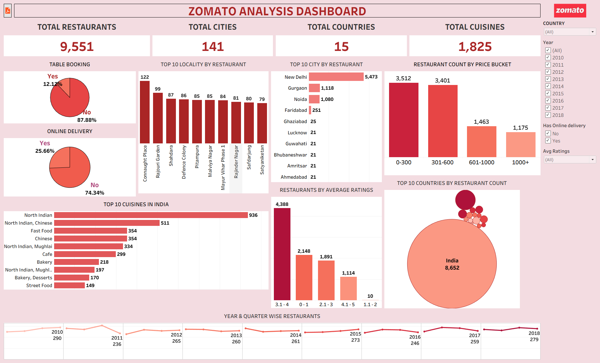

# Zomato Analytics

## Project Overview

Zomato Analytics is a restaurant data analysis project developed as part of the Exceler Data Analyst Project.

The project uses Microsoft Excel to analyze restaurant data and create a dashboard covering restaurant distribution, restaurant openings, ratings, pricing, cuisines, and restaurant services.

## Week 1 — Excel Dashboard

The first phase of the project focuses on analyzing the Zomato restaurant dataset using Microsoft Excel and developing the Zomato Analytics Dashboard.

### Analysis Performed

- Country and city-wise restaurant analysis
- Restaurant openings by year, quarter and month
- Restaurant distribution based on average ratings
- Restaurant distribution based on average price
- Percentage of restaurants with table booking
- Percentage of restaurants with online delivery
- Analysis based on cuisines, city and ratings

### Tools & Techniques

- Microsoft Excel
- Excel Formulas
- PivotTables
- PivotCharts
- Data Analysis
- Dashboard Design

## Dashboard

The Excel dashboard summarizes the analysis and presents key restaurant-related insights in a visual format.

## Project Files

- `ZOMATO_ANALYTICS.xlsx` — Complete Excel workbook containing the analysis and dashboard.

## Future Project Phases

This project will be expanded in the subsequent phases of the Data Analyst Project:

- Power BI
- Tableau
- SQL

## Week 2 — Tableau Dashboard

The second phase of the project focuses on analyzing the Zomato restaurant dataset using Tableau and developing an interactive Zomato Analytics Dashboard.

### Analysis Performed

- Country and city-wise restaurant analysis
- Top 10 cities by restaurant count
- Top 10 localities by restaurant count
- Restaurant count by price bucket
- Top 10 cuisines in India
- Restaurant distribution based on average ratings
- Percentage of restaurants with table booking
- Percentage of restaurants with online delivery
- Year-wise restaurant analysis
- Interactive analysis using filters for Country, Year, Online Delivery and Average Rating

### Tools & Techniques

- Tableau
- Data Visualization
- Interactive Dashboards
- Filters and Dashboard Interactivity
- KPI Cards
- Bar Charts
- Pie Charts
- Line Charts
- Geographic Analysis

### Tableau Dashboard

The Tableau dashboard provides an interactive visualization of Zomato restaurant data and enables users to explore restaurant trends and insights using interactive filters.

### Tableau Project Files

- `ZOMATO_ANALYTICS_DASHBOARD.twbx` — Tableau workbook containing the dashboard and analysis.
- `ZOMATO_ANALYTICS_DASHBOARD.mp4` — Video demonstration of the interactive Tableau dashboard.
- `ZOMATO_ANALYSIS_TABLEAU.pdf` - PDF Format of the Tableau Dashboard.
